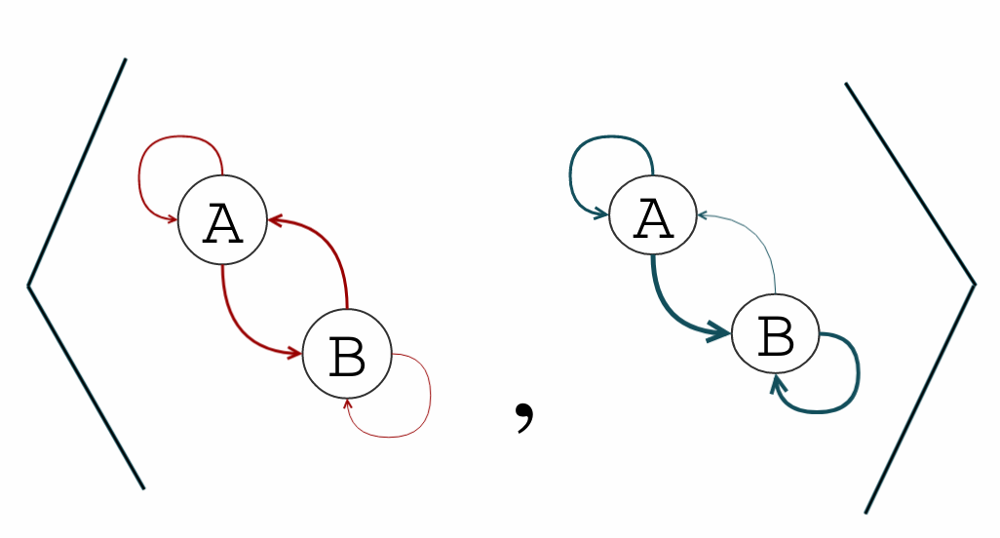
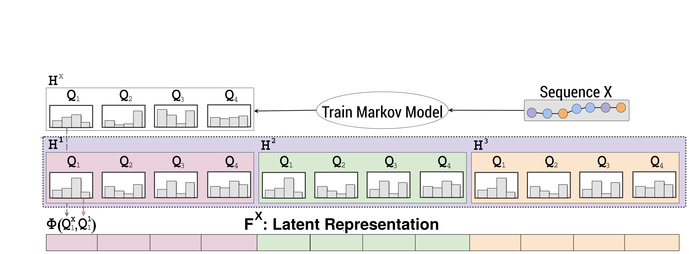

# Markov Chains Latent Representation by Micro-similarities

A C++ implementation of various and new methods of representing Markov Chains in a latent space that hypothetically relates the Markov model in hand with multiple pre-trained Markov models. An example usage for this representation is to base the classification of sequences using the latent representation then applying a secondary classifier, as an alternative to classifying sequences using the maximum propensity method. The current results show that the prediction performance is improved while retaining the explanatory power of the generative models.

## Installation on Linux

### Prerequisites

- Install [Python-64bits](https://www.python.org/downloads) or run `apt-get install python3 python3-pip`, 32-bits version won't work. Python is used for Conan package manager installation.
- Install conan, c++ package manager, preferably running `pip install conan`. For more information and alternative installation options, please refer to [conan manual page](http://docs.conan.io/en/latest/installation.html).
- Install [CMake](https://cmake.org/) for generating the build script.

### Building

- Run `conan remote add bincrafters https://api.bintray.com/conan/bincrafters/public-conan`
- Run `conan remote add a-alaa https://api.bintray.com/conan/a-alaa/public-conan`.
- In this repository folder create `build` folder and, after moving into the new folder, run `conan install .. -s build_type=Release --build missing`.
- Run `cmake .. -DCMAKE_BUILD_TYPE=Release`.
- Run `make -j8`.

### Installation

- Run `make install` from the `build` directory. By default, this will require root privileges, unless you change the `CMAKE_INSTALL_PREFIX` variable to a local directory.

## Applications

The following tutorials (will be updated regularly), demonstrates the various applications of this project:

- [Tutorial on Benchmarking Performance of Protein Subcellular Localization Prediction by Different Methods](wiki/Tutorial:-Benchmarking-Protein-Subcellular-Localization-Prediction)

## LICENSE

This project uses the MIT license. Please see [LICENSE.txt](LICENSE.txt) in the main directory for more details.